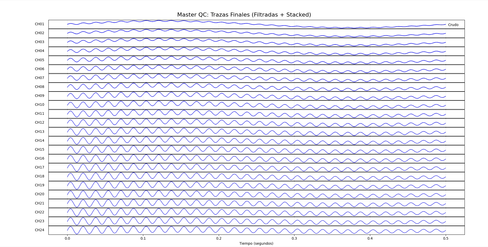
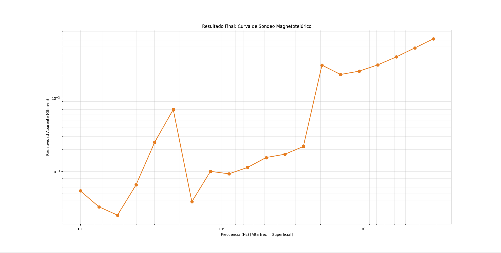
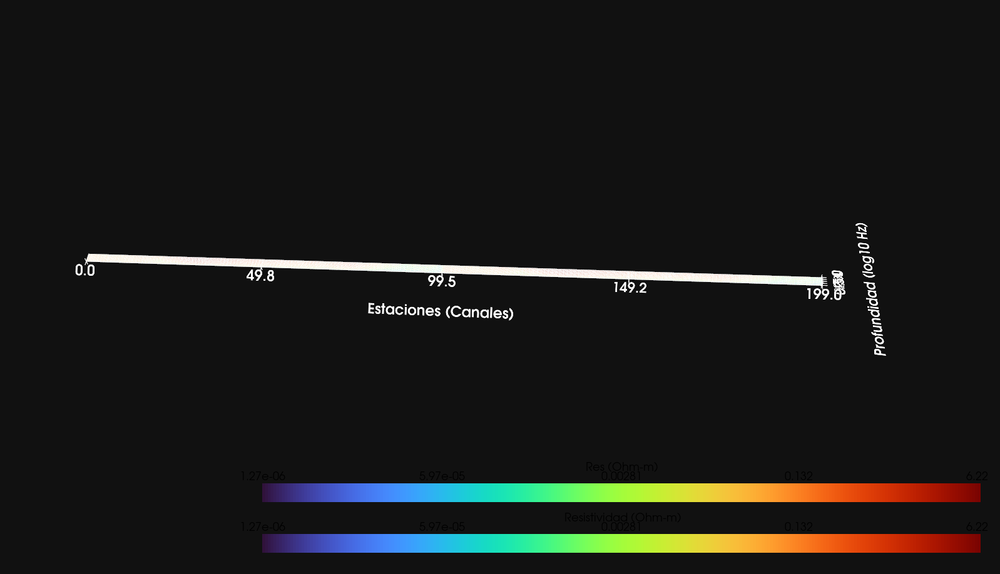
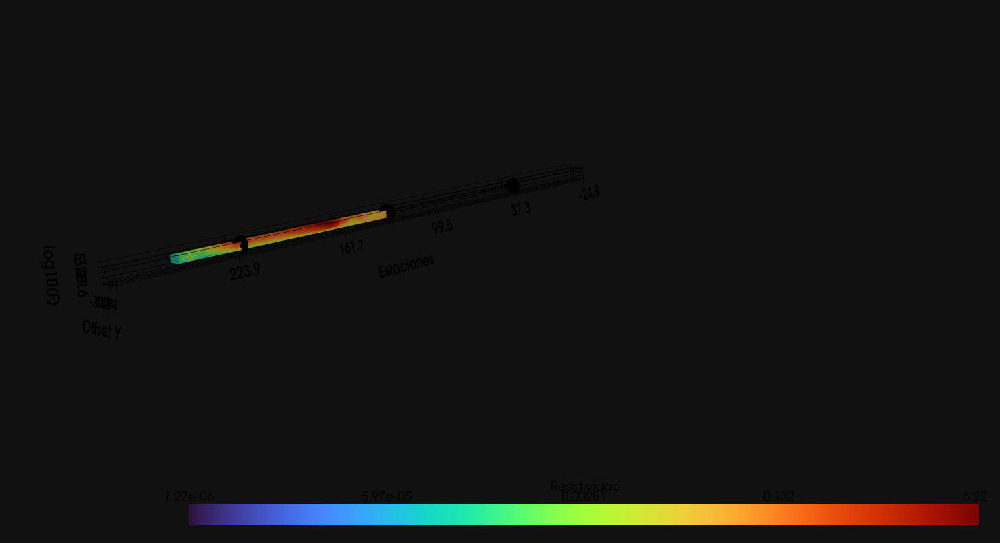

# Geophysical Imaging Framework (GIF)

Framework de alto rendimiento para el procesamiento de señales magnetotelúricas y electromagnéticas. El sistema combina la flexibilidad de Python con la potencia de cómputo de C++ mediante paralelismo con OpenMP.

## Características Principales
- **Motor Híbrido C++/Python:** Procesamiento de señales de bajo nivel en C++ con interfaz de usuario y análisis científico en Python.

- **Procesamiento Multicanal:** Arquitectura diseñada para manejar estaciones de 24 canales simultáneos con datos de alta frecuencia (24kHz).

- **Filtrado Digital Pro:** Implementación de filtros IIR (Secciones de Segundo Orden - SOS) optimizados para eliminar ruido de línea de 60Hz con alta selectividad (Q=100).

- **Stacking Estadístico Paralelo:** Reducción de ruido aleatorio mediante promediado de segmentos optimizado con OpenMP para ejecución multihilo.

- **Análisis Geofísico:** Cálculo de impedancia de Cagniard y estimación de resistividad aparente para exploración del subsuelo.

- **Visualización 3D Avanzada:** Integración con PyVista para análisis volumétrico e interactivo del subsuelo.

## Estructura del Proyecto
- **src/cpp/:** Código fuente en C++ (filtros, stacking y carga binaria).

- **src/processing/:** Bridge de comunicación (ctypes) y motores de cálculo geofísico.

- **src/visualization/:** Módulos de visualización 2D (Matplotlib) y 3D (PyVista).

- **data/raw/:** Repositorio de datos binarios de alta tasa de muestreo.

- **main_processor.py:** Orquestador principal del flujo de trabajo maestro.

## Requisitos Técnicos
- Compilador G++ (soporte para OpenMP).

- Python 3.10+.

- Bibliotecas: NumPy, SciPy, Matplotlib.

## Instalación y Compilación
- **Compilar el motor de procesamiento:** ``g++ -O3 -shared -fopenmp -o build/libfiltros.dll src/cpp/filtros.cpp``

- **Instalar dependencias:** ``uv sync``    

## Flujo de Trabajo Maestro
El procesador principal ejecuta el siguiente pipeline:

1. Carga directa de memoria de archivos binarios ``.raw``.

2. Filtrado Notch adaptativo en paralelo sobre los 24 canales.

3. Limpieza de señal mediante stacking estadístico de 15 segmentos.

4. Transformada de Fourier enfocada para extracción de magnitudes.

5. Generación de curvas de resistividad aparente vs frecuencia.

6. Visualización: Generación de pseudo-secciones 2D y modelos volumétricos 3D.

## Resultados de Rendimiento
El framework es capaz de procesar un levantamiento completo de 24 canales en tiempo récord:

- Tiempo de carga: ~0.007s

- Procesamiento de señales (Filtrado + Stacking): ~0.4s

- Interpolación de alta resolución: < 0.01s

## Visualización de Resultados

El framework genera reportes visuales automáticos para el control de calidad y la interpretación final:

### **1. Control de Calidad de Trazas (QC)**
Muestra las señales de los 24 canales tras la limpieza multietapa (Filtrado Notch + Stacking). Esta visualización permite verificar la coherencia espacial y la eliminación de ruido de línea.

### 2. Curva de Sondeo Magnetotelúrico
Resultado final que muestra la Resistividad Aparente frente a la Frecuencia. Esta curva es la base para la interpretación geológica, donde las altas frecuencias representan capas superficiales y las bajas frecuencias penetran a mayor profundidad.

### 3. Análisis Volumétrico y Slicing 3D (PyVista)
La integración con PyVista permite realizar cortes dinámicos (Slicing) en el volumen de resistividad interpolado, facilitando la identificación de anomalías conductoras y cuerpos mineralizados.

